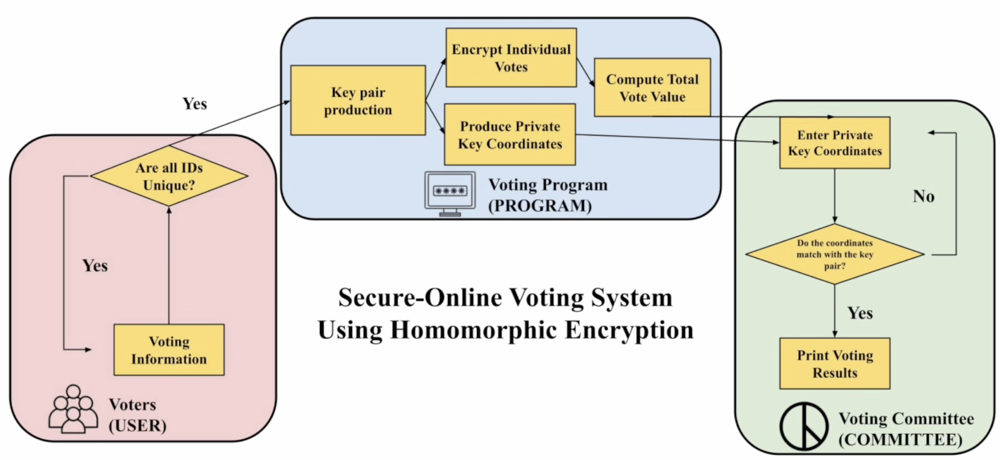

# VotingProgram

<!-- PROJECT LOGO -->
<br />
<div align="center">
  <a href="#">
    
  </a>

  <h3 align="center">Secure-online Voting System Using Homomorphic Encryption
</h3>

  <p align="center">
    In this research, a complete online voting system will be suggested as a replacement for the current voting system with several flaws. To complete this, homomorphic encryption and the Paillier system is used to handle the encryption and decryption of the voting information. Also, the SSS algorithm is used for an additional security measure. Using the characteristics of homomorphic encryption, the program can encrypt the votes to authenticate them and complete the summation while the votes are encrypted, where the original votes are not revealed in this process. In result, the created online voting system uses homomorphic encryption for the voting process, encryption and decryption to create the basic secure environment for a successful online voting process.
  </p>
</div>


## Getting Started

To execute the project, follow these instructions:

### Installation


1. Clone the repo
   ```sh
   git clone https://github.com/csong2023/lunargalademo.git
   ```
2. Install Python modules
   ```sh
   pip3 install PySimpleGUI
   pip3 install sympy
   ```
3. Run the code!
   ```sh
   Command + B / Ctrl + B
   ```
<p align="right">(<a href="#readme-top">back to top</a>)</p>